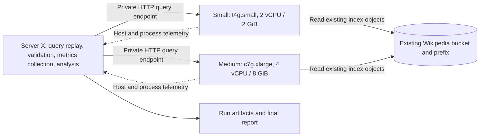

# Wikipedia read benchmark plan

Status: execution started September 6, 2026 UTC, following user authorization.
Both benchmark nodes use the requested Polign **0.5.0** release; the public
demo stays unchanged. Server X is `c7g.2xlarge`; all three nodes are isolated
in `us-west-1b` with a 24-hour automatic termination deadline.

Execution inventory found `s3://polign-demo-wiki-en-uw1/polign-v4`, collection
`wikipedia_bge`, generation 45, 3,538 IVF cells, and exactly 12,519,135 records
in the manifest's live segment counts. This generation stores full-precision
vectors and has no PQ codebook or ID filters. Rescore sweeps and full-corpus
exact recall are therefore omitted: rescore does not apply, and a complete
verified vector export is unavailable. The source index is not modified.

The larger accuracy set uses 300 published Natural Questions Open dev examples,
100 disjoint tuning examples, and 10,000 real training questions for load, all
with the existing demo model. Report token-bounded answer-containing passage
Hit@k and MRR, plus the original 30 title-based regression questions. These
published answer annotations replace the proposed new passage-judging exercise;
graded nDCG is not measured, and answer presence is labeled as a retrieval proxy.
Date-sensitive questions may disagree with the 2023 Wikipedia snapshot.
[NQ-Open source and task definition](https://github.com/google-research-datasets/natural-questions/tree/master/nq_open).

Raw fixtures, telemetry, and runs are stored under `bench/wikipedia/artifacts`
and on Server X; `bench/wikipedia/dataset.json` records the source fingerprint.
Resource watchdogs distinguish reclaimable file cache from nonreclaimable
memory when applying the 95% hard-budget abort threshold.

Build a reproducible benchmark of the existing Wikipedia collection that shows
client-observed latency, successful QPS, retrieval quality, and resource use on
small and medium Polign servers. Every measured search travels from a separate
benchmark host to the database's HTTP endpoint. The database reads the existing
demo bucket directly. Corpus vectors, indexes, and bucket contents stay unchanged.

## 1. Starting point verified in the current demo

The public [dataset metadata](https://demo.polign.com/demo/meta), read while
preparing this plan, reports 12,519,135 passages from 5,355,565 articles,
`wikimedia/wikipedia 20231101.en`, embedded using `BAAI/bge-small-en-v1.5`.
It exposes semantic, keyword, and hybrid modes. This is a deployment-reported
count; verify the stored manifest independently before claiming the benchmark
searched that many records.

Code inspected: `polign_demo` commit `2b18f9b` and `polign_db` commit `3bcd7c9`.
The running database binary's version and checksum remain a preflight check.

| Existing component | How the benchmark uses it |
| --- | --- |
| [Database service configuration](../deploy/polign-node.service) | Starting read configuration: no restore, hot promotion, persistence, maintenance, or WAL following; 6 GiB disk cache, 256 MiB segment cache, 150 ms read hedging. |
| [Demo configuration](../deploy/polign-demo.service) | Expected collection `wikipedia_bge`, dimension 384, `nprobe=8`, demo `k=8`. Confirm actual running settings. |
| [HTTP client](../internal/polign/client.go) | Wire contract for `POST /v1/collections/{collection}/query`, including `cold`, `nprobe`, and `rescore`. |
| [Query embedder](../serve/embedserve.py) | Reuse the model revision, tokenizer, ONNX artifact, normalization, and query instruction prefix. |
| [Quality evaluation](../eval/README.md) | Preserve the existing 30-query regression set and its historical results. Add a larger held-out evaluation. |
| `polign_db/cmd/loadtest` | Reference for reporting only. It defaults to seeding 10,000 synthetic vectors and generating random queries; it is unsuitable as-is for this task. |
| `polign_db/internal/transport/adminserver` | Existing read endpoints expose configuration, active generations, and disk-cache counters. They do not provide all runtime and S3 telemetry required below. |

Historical timings in the README and blog are context, not new benchmark results.
The 30-query evaluation's flat quality across `nprobe` values does not establish
that ANN recall is flat across the whole corpus.

## 2. Deployment and read-only boundary



Test one database host at a time for the primary size comparison. Keep the
public demo serving normally. Server X generates load, receives full responses,
validates them, and produces the report; it does not search an in-process index
or run a local substitute for the measured database.

Use private addresses in the same AZ/VPC for X and the database nodes, with
the bucket in the same region. Record the actual topology, S3 endpoint route,
network RTT, HTTP version, TLS setting, and connection pool. The primary result
includes the real network hop and JSON response body, including passage metadata.
The existing UI, its public rate limiter, and live query embedding are outside
this database benchmark's measured path.

Preflight must discover the actual bucket, prefix, region, manifest/generation,
index layout, encryption requirements, server build, and effective flags from
the deployed service. Never infer the bucket from an example placeholder. Pin
binary and input checksums for both sizes. Confirm that index writers and GC
will not change/delete the referenced generation during the test window; record
generation fingerprints before and after every run and periodically during long
runs. Invalidate runs if the dataset changes. Do not copy or republish the index
to make a benchmark snapshot.

Enforce the read boundary in both software and infrastructure:

- Give the benchmark database nodes a dedicated instance role limited to reading
  the existing bucket/prefix, including prefix-scoped listing and any required
  decrypt permission. Exclude object writes/deletes and bucket administration;
  use an explicit mutation deny as defense against inherited write grants.
- The driver exposes only query, health, description, and explicitly selected
  read-validation operations. It has no create, seed, upsert, update, delete,
  import, compaction, or collection-registration operation.
- Prefer explicit `-segment-stores` over the `-store` convenience preset. Bind
  the data endpoint to the benchmark private interface; allow ingress only from
  X. Bind the admin endpoint to loopback and collect locally. Do not call the
  admin storage-probe endpoint, which is outside this read-only workload.
- Keep results on X and, if archived remotely, in a separate benchmark artifact
  location. Local cache writes and report files are expected; no writes go to
  the demo bucket. Verify IAM policy and zero attempted store mutations without
  sending a test PUT/DELETE to the live dataset.

Illustrative database startup, validated against the pinned binary before use:

```sh
AWS_REGION="$BENCH_REGION" GOMEMLIMIT=1000MiB /opt/polign/bin/polign-server \
  -segment-stores "$EXISTING_DEMO_STORE" -cold-first=true \
  -restore-stores "" -log-stores "" -persist=false -maintain 0 \
  -hot-max 0 -tail-fresh=false -split-qps 0 -placement-refresh 0 \
  -http "$BENCH_PRIVATE_IP:23000" -grpc 127.0.0.1:23001 \
  -admin 127.0.0.1:23002 \
  -disk-cache-dir /var/lib/polign/benchmark-cache \
  -disk-cache-bytes 6442450944 -segment-cache-bytes 268435456 \
  -segment-refresh 5m -hedge-reads 150ms
```

No `polign-import`, `index/prepare.py`, `index/embed.py`, index conversion, or
maintenance is part of this benchmark. If the existing index cannot be read by
the selected server version, resolve compatibility using a compatible binary;
do not rewrite the dataset.

## 3. Hardware and controlled settings

The requested comparison is the existing `t4g.small` size and a 4-vCPU
instance. Use `c7g.xlarge` for the larger tier to measure sustained serving
capacity on a non-burstable ARM instance.

| Role | Proposed hardware | Purpose |
| --- | --- | --- |
| Small database | `t4g.small`: 2 vCPU, 2 GiB | Matches the demo's documented host size; database and monitoring only. |
| Medium database | `c7g.xlarge`: 4 vCPU, 8 GiB | Measures the capacity of a larger, non-burstable database host. |
| Server X | Dedicated, non-burstable ARM instance with at least 8 vCPU and 16 GiB | Load generation and collection; heavy analysis runs after measurement. Increase only if calibration shows a client bottleneck. |

The small node uses Graviton2 and the larger node uses Graviton3; both run the
same ARM64 binary. Report the comparison as instance-capacity scaling, including
the CPU generation, core count, RAM, and network/EBS differences. Attribute
observed gains to the combined hardware change rather than to CPU count alone.
[AWS T4g specifications](https://aws.amazon.com/ec2/instance-types/t4/),
[AWS C7g specifications](https://aws.amazon.com/ec2/instance-types/c7g/).

Use matching OS image, architecture, server binary, HTTP pool, hedging, query
parameters, 20 GiB gp3 volumes, and explicitly matched provisioned IOPS and
throughput. Record instance-level EBS/network limits as well as volume settings.
Prefer on-demand nodes for controlled runs. Test restart behavior explicitly.

Run two configuration comparisons:

1. **Matched configuration:** 256 MiB segment cache, 6 GiB disk cache,
   `GOMEMLIMIT=1000MiB`, and a 1536 MiB cgroup hard memory budget on both nodes.
   Use all available vCPUs and record effective `GOMAXPROCS`. This compares the
   same database memory/cache settings on each host; host RAM and hardware
   differences remain visible in the results.
2. **Medium tuned configuration:** a preregistered 2 GiB segment cache,
   `GOMEMLIMIT=5120MiB`, and a 6144 MiB cgroup hard memory budget, with the same
   disk cache and query settings. Show this separately so the benefits and
   resource costs of using the larger host's memory are visible.

The hard budgets leave host headroom on both sizes. Record actual cgroup
charges, including file cache. `GOMEMLIMIT` is a Go runtime soft limit, not a
process or host memory cap.
[Go GC guide](https://go.dev/doc/gc-guide).

Set and report the small node's T4g credit mode explicitly. For capacity tests,
use unlimited mode with surplus CPU charges included in cost. Record opening
and closing credit balances and the full credit timeline. The C7g node has no
CPU-credit budget; mark credit metrics as not applicable for that tier. A short
T4g run funded by accumulated credits cannot establish sustainable performance
at the base instance price.
CloudWatch credit metrics have five-minute resolution; do not present them as
one-second measurements. [AWS CPU credit metrics](https://docs.aws.amazon.com/AWSEC2/latest/UserGuide/burstable-performance-instances-monitoring-cpu-credits.html),
[unlimited mode](https://docs.aws.amazon.com/AWSEC2/latest/UserGuide/burstable-performance-instances-unlimited-mode.html).

## 4. Query fixtures and accuracy

Prepare immutable query fixtures once, before timing begins. Reuse saved query
embeddings if available; otherwise embed only the benchmark query texts with
the existing model artifacts. This does not regenerate any corpus vectors.
Store model/tokenizer checksums, query-prefix policy, float encoding, text,
query ID, length/category, expected articles, and a fixture checksum.

Use these distinct sets:

- **Regression:** the existing 30 questions unchanged, retaining historical
  title-matching semantics for comparison with `eval/results`.
- **Judged quality:** at least 300 questions across factual, relational,
  paraphrased, rare-entity, ambiguous, and broad-topic searches. Split 100 for
  tuning and 200 held out before parameter selection. Keep article/topic
  overlap across the split low. Review acceptable answers and a pooled set of
  candidate passages; include irrelevant and partially relevant hits. Record
  judge/review provenance and adjudicate ambiguous labels.
- **Load:** at least 10,000 distinct realistic questions, with deterministic
  shuffled and popularity-skewed replays. Grow this set after a pilot if it
  trivially fits the effective caches. Measure distinct-query count and S3
  miss rate instead of assuming question count determines cache locality.

Primary query: semantic, `cold=true`, `nprobe=8`, `k=10`, full metadata.
Explicitly record the effective rescore policy; `rescore=0` means a versioned
server default, not zero exact rescoring. Include a smaller `k=8` row to match
the current demo and `k=20` sensitivity rows. Benchmark keyword and hybrid as
separate secondary workloads and quality tables; do not blend their QPS into
the semantic headline.

Run the following accuracy checks:

| Measure | Definition and interpretation |
| --- | --- |
| Hit@1/3/10 and MRR@10 | Whether a judged acceptable article is retrieved and its first rank; separately report passage-level and article-deduplicated results. |
| nDCG@10 | Ranking quality over reviewed graded passage judgments. Report the judgment pool and coverage; unjudged results must not silently become irrelevant. |
| Under-load quality | Replay the held-out queries at baseline and supported load points; compare scores with paired query-level confidence intervals. Count timeouts/errors as failed retrievals in service-level quality. |
| Response correctness | Validate schema, unique IDs, finite distances/scores, requested hit count when applicable, required metadata, and metric/mode-appropriate ordering. Check sampled distances against exact stored vectors when readable. |
| Result stability | Compare IDs/ranks across sizes, cache states, and restarts with the same dataset/parameters. Handle numeric ties using a recorded tolerance; investigate differences rather than assuming agreement establishes relevance. |

For **ANN recall@10 against exact nearest neighbors**, first check whether a
complete existing vector export and ID inventory are available and provably
match the measured generation. An exact reference can be computed on X from
those original vectors, with chunked brute-force squared-L2 search, without
embedding or indexing again. Persist its input and result hashes and validate
the evaluator with small known-answer fixtures.

There is a real feasibility constraint: the current database's cold path does
not support complete vector listing, and point reads depend on index support.
Do not assume `GET /vectors` enumerates all 12.5M records. If an existing ID
inventory is available, assess read-only batch retrieval through the DB endpoint
in a separate preparation phase. The vector values alone are about 17.9 GiB
in float32, before IDs, metadata, and JSON expansion. Time/cost this extraction
separately, and reset benchmark caches afterward.

If a complete, verified vector reference is unavailable, publish the judged
retrieval metrics and label exact ANN recall **not measured**. A wider
`nprobe`/rescore run is only reference-result agreement; it is not exact ground
truth. Never rebuild or compact the demo index to unblock this optional metric.

Use the tuning split for `nprobe=8/16/32/64` and a small rescore sweep. Freeze
selected parameters before held-out evaluation. Present the latency/quality
tradeoff alongside the untouched demo configuration, including quality failures.

## 5. Load methodology and test matrix

Implement a dedicated Go driver under `cmd/benchmark` with read-only benchmark
code under `internal/benchmark`. Reuse the HTTP contract, but do not expose the
demo client's mutation methods through the benchmark interface. Prebuild
request bodies, reuse connections, stream logs, and keep all queues bounded.

Support both fixed-concurrency and scheduled-arrival modes. Fixed concurrency
answers how throughput changes with concurrent requests. Scheduled arrivals
continue at the chosen rate when responses slow down, exposing queueing and
overload that a closed-loop client would hide.

For each request, record scheduled time, actual send time, full-body completion,
validation completion, status/error, timeout, query ID, response bytes, and hit
IDs/scores. Report dispatch delay, send-to-completion latency, and
schedule-to-completion latency separately. Use monotonic durations and UTC event
timestamps. Report dropped arrivals and bounded-queue overflow as failures.
Primary measurements use a fixed 10-second deadline and no client retries;
record server-side S3 retries/hedges separately. Drain or cancel outstanding
work explicitly at the end and account for every scheduled request.

Report offered rate, attempted rate, completed QPS, successful QPS, and
**goodput** (valid responses within the chosen latency target). Errors must not
inflate the successful-QPS headline. Histograms include success and failure
distributions, p50/p90/p95/p99/max, sample count, and timeout count. Do not average
percentiles across workers or silently omit timed-out requests. Mark p99 as
weak evidence when a run has too few observations; aim for at least 10,000
completed requests at each headline point, extending the run when necessary.

| Phase | Proposed execution | Evidence produced |
| --- | --- | --- |
| Smoke and calibration | One query of each mode, fixtures/metadata checks, 60 seconds at concurrency 1; then a short mock-responder driver ceiling check on X | Correct dataset/configuration and load-generator headroom. |
| First touch | Five fresh-node/cache-reset repetitions; small fixed diverse query sequence, report the first request and every subsequent warming request separately | Boot-to-first-valid-result time and the cold-to-warm transition. |
| Cache isolation | Fresh process with retained disk cache; separately a fresh process with a new empty benchmark cache directory | Process-cold/disk-warm versus empty-local-cache performance. |
| Concurrency discovery | `1,2,4,8,16,32,64` workers, 60 seconds each; stop extending after clear overload | Approximate knee and four representative formal load points. |
| Formal throughput | Four points spanning low load, below knee, knee, and overload; both broad and popularity-skewed mixes; 2-minute warmup plus at least 10-minute measurement, three repetitions | Latency/QPS/resource curves and repeatability. |
| Arrival-rate validation | Offered rates at roughly 50/75/90/100/125% of pilot capacity, five minutes each, three repetitions around the boundary | Sustainable rate, queueing, rejection, and goodput. |
| Burst and recovery | Stable 50% load, 30-second burst to 2x capacity, then five minutes back at 50%; repeat three times | Queue growth, bounded resources, and time to recover. |
| Soak | Two hours at 70–80% of the accepted sustainable rate for each size; extend selected configuration to 24 hours before an endurance claim | Memory/CPU trend, cache churn, credit use, errors, and latency drift. |
| Restart and replacement | Three restarts retaining disk cache and three replacements with empty local cache on benchmark nodes | Time to first correct query, interrupted requests, and return to stable capacity. |
| Resource controls | Cache churn at fixed budgets; separate tests with explicit server rate limiting; medium tuned-cache comparison | Cache bounds, 429 behavior, memory headroom, and benefits/costs of tuning. |

Warmup is not a claim of a fully warm corpus. Require a stable cache-hit/latency
window, capped at ten minutes, or label the measured run as still warming.
`cold=true` selects storage-backed search; it does not mean a cache miss.
Restarting a process does not empty the disk cache or OS page cache. For a
strong local-cold claim use a fresh node or a stopped service with a fresh,
run-owned cache directory. Never clear the public demo's caches or global host
caches. S3's internal caching is not controllable; label cold claims accordingly.

Randomize formal run order and alternate size order across repetitions. Keep
cache preparation and query schedules identical. Do not run ground-truth
extraction, report generation, or a second load suite concurrently. Record X's
CPU, network, GC, and dispatch lag. Repeat selected points with a larger X if
generator headroom is doubtful; a client-limited result is not database capacity.

## 6. Resource telemetry throughout each test

Start collection at least 60 seconds before load and retain at least five
minutes after it. Use one-second host/process samples, five-second lightweight
admin samples, and the provider's native resolution for cloud metrics. Record
missing samples and clock offsets. Keep collector CPU/storage overhead visible.

| Layer | Required observations |
| --- | --- |
| Client workload | Offered/successful QPS, goodput, actual concurrency, queue length/lag, status codes, timeouts, bytes, validation failures. |
| Database process | CPU seconds and vCPU-normalized utilization, RSS/PSS, peak RSS, threads, descriptors, restarts, Go heap/live bytes, GC CPU/pauses, goroutines. |
| Host and cgroup | Total memory, available memory, anonymous/file-cache split, `memory.current/peak/events`, OOM events, CPU throttle time, user/system/iowait/steal, run queue, swap, CPU/memory/I/O pressure. |
| Local storage | Cache bytes/entries and hit/miss deltas, eviction/churn if instrumented, filesystem free space, read/write bytes, IOPS, latency and queue depth. |
| Object store | Physical GET/range/HEAD/LIST attempts, bytes, read latency, errors, SDK retries and hedge attempts; zero mutation attempts. Distinguish physical requests from logical reads. |
| Network | Bytes/s, packets, retransmits, connections and RTT; database-to-S3 and X-to-database traffic attribution where available. |
| Cloud | Instance/volume settings and limits, CPU credit usage/balance/surplus/charges, EBS metrics, interruption/status events. |

Use `/proc`, cgroup v2, `pidstat`/`iostat`/`vmstat` or equivalent collectors for
host data. Existing admin overview/tiers/collections endpoints provide some
cache/configuration/generation data. Do not assume a Prometheus `/metrics` or
pprof endpoint already exists in the current binary.

Add a small, separately reviewable, loopback-only telemetry surface in
`polign_db` for missing Go runtime and object-store/cache counters. Use bounded
histograms and low-cardinality labels, and preserve search/storage behavior.
Count physical S3 attempts below the hedge wrapper and at the SDK transport so
retries and canceled hedges are not hidden. Bucket-wide metrics cannot isolate
these nodes from live-demo traffic. Expose zero write-attempt counts as part of
the run evidence. Benchmark the instrumentation on/off before accepting it;
reduce sampling or record the overhead if it changes throughput/latency
materially. Keep full CPU/heap profiling to separate diagnostic runs.

Plot time-aligned workload and resource data so a p99 spike can be compared
with CPU saturation, GC, cache misses, disk I/O, and S3 traffic. Report CPU
seconds/query, S3 requests and bytes/query, peak memory, and time above resource
thresholds, in addition to averages.

## 7. Acceptance criteria and claim boundaries

Freeze run configuration and targets after the pilot and before the formal
held-out runs. Suggested initial targets, not predictions of current behavior:

- Successful response rate at supported load: at least 99.9%; no silent
  corruption, malformed responses, or unexpected OOM/restarts.
- Provisional p99 targets: 250 ms for a warmed repeated-query mix and 1 second
  for the broader sustained mix. Report first-touch latency separately. If
  these targets are missed, show the miss and capacity at looser targets rather
  than moving the target after seeing formal results.
- No more than a two-percentage-point absolute loss in held-out Hit@10 or
  nDCG@10 relative to the same configuration at concurrency 1, with paired
  confidence intervals. Report absolute quality too; stable low quality is not
  evidence of good retrieval.
- No unbounded memory/queue/cache growth during soak. Compare stabilized
  windows, slope, peaks, and OOM/pressure events; investigate a live-memory rise
  above 10% between the first and last stable 30-minute windows.
- Recovery target: return to the pre-burst latency/error envelope within
  60 seconds after load falls. Record restart recovery against a provisional
  30-second first-valid-query target, plus time to restored warm capacity.
- Read-only evidence: no source-object mutation attempts and unchanged dataset
  fingerprints. Every run must have reproducible provenance and complete
  request accounting.

Define sustainable QPS as the highest repeated scheduled-arrival point meeting
the chosen latency, error, and quality targets without continuing queue/resource
growth, then verify below that boundary in the soak. Report a range if the
boundary is noisy. Use block/repetition-aware intervals for performance and
paired query bootstrap intervals for quality; retain every repetition.

Automatic aborts for ordinary capacity runs: sustained >5% failures for 30
seconds, memory above 95% of its hard budget for 30 seconds, critically low
disk space, generation change, monitoring loss, or the run's time/cost limit.
Overload phases have explicit bounded exceptions and their own stop conditions.
All resets and disruptions target benchmark nodes only.

The final conclusion should state the tested read-serving operating envelope
and any failures. This work can demonstrate dataset scale, concurrent query
capacity, resource bounds, and recovery from disposable-node replacement. A
fixed 12.5M-record dataset does not establish growth scaling to larger corpora.
Single-node restarts do not demonstrate HA or uninterrupted failover; this
read-only study does not measure write durability or ingestion performance.

## 8. Implementation work and deliverables

| Work item | Concrete output | Completion check |
| --- | --- | --- |
| A. Inventory and manifest | `bench/wikipedia/dataset.json`, pinned server/config manifest, IAM/network recipe, resource/cost estimate | Existing generation and model identified; read access works without write grants. |
| B. Fixtures and judgments | Query JSONL, query vectors, split manifest, graded judgments and scorer; optional exact-reference artifacts | Deterministic hashes; original 30-query scorer reproduced; held-out set locked. |
| C. Read-only driver | `cmd/benchmark`, `internal/benchmark`, sample run configs | Tests cover endpoint allowlisting, scheduling under a stalled server, cancellation, percentile merging, failures, and response validation. |
| D. Provisioning and telemetry | Tagged temporary-node setup/teardown scripts, systemd units, collectors, optional DB telemetry change | Resource samples reconcile with host tools; no secret values in artifacts; source bucket receives no mutations. |
| E. Pilot and frozen protocol | Driver ceiling check, initial curves, selected formal points, targets and cost cap | Generator has headroom; cache state and credit behavior documented. |
| F. Formal execution | Complete matrix, quality evaluation, soak/recovery logs, run validity decisions | Raw artifacts collected and checksummed before node teardown. |
| G. Analysis and report | Standalone HTML, Markdown findings, PDF, CSV/Parquet, SVG/PNG charts, reproducibility README | Every plotted point traces to run IDs; tables/charts regenerate from raw data. |

Suggested artifact layout:

```text
bench/wikipedia/
  configs/                 # node profiles, workloads, frozen targets
  fixtures/                # text, query vectors, judgments, provenance
  scripts/                 # provision, collect, execute, archive, teardown
  analysis/                # scoring, aggregation, plots, report generation
  runs/<run-id>/
    manifest.json          # builds, dataset, fixture hashes, host, flags, times
    requests.jsonl.zst     # timings, IDs, status, scores, bytes; no credentials
    latency.hdr            # mergeable histogram data, including error counts
    host-metrics.parquet
    process-metrics.parquet
    storage-metrics.parquet
    cloud-metrics.json
    events.jsonl
    validation.json
    checksums.sha256
  report/
    index.html
    findings.md
    findings.pdf
    summary.csv
    charts/
```

Keep large raw artifacts outside Git; commit code, small fixtures, manifests,
and report source. Store sampled full responses only where needed for quality
audit, avoiding unbounded per-request passage-text logs on X.

The report starts with a small-versus-medium table at a stated latency/error
target: sustainable QPS, p50/p95/p99, quality, peak process/host memory, CPU use,
S3 reads/query, and cost per million successful queries. Include:

1. QPS versus concurrency and p99 versus offered QPS, with repetitions.
2. Cold start, disk-cache-warm restart, and warm steady-state comparisons.
3. CPU/RAM/cache/I/O/S3 timelines for ramps, bursts, and soak.
4. Quality by query category and mode, plus the quality/latency tuning curve.
5. Recovery timeline, error/rejection behavior, and observed limiting resource.
6. An operating recommendation for each size: configured budgets, sustainable
   rate, headroom, and the conditions that call for a larger node.

Compute cost with rates retrieved for the actual region/date and include
instance hours, surplus CPU, EBS, S3 requests/data transfer, networking, and
telemetry. Separate benchmark-only X/judging/reference-computation cost from
serving cost. Show storage already paid for by the existing corpus separately.
Cost per million successful queries uses achieved goodput for the stated SLO
and workload, not a peak burst or advertised credit-free rate.

Planning estimate: 4–6 engineering days for the harness, telemetry, fixtures,
pilot, and report pipeline, with judgment review scheduled explicitly. Reserve
roughly one day for the core measured suite and analysis; formal runs are
sequential across sizes, while telemetry is collected concurrently. A 24-hour
soak for both sizes adds 48 database-node hours. Full exact-reference extraction
and brute force are a separately estimated preparation task after feasibility
is known. Before provisioning, calculate the actual matrix's node hours and
request budget from the pilot and current prices; set maximum duration, spend,
and artifact size in the run config. No instances or spend are created by this
planning document.
